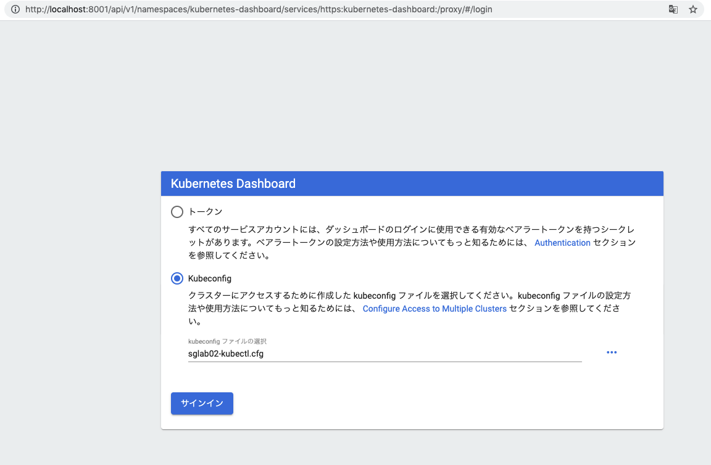
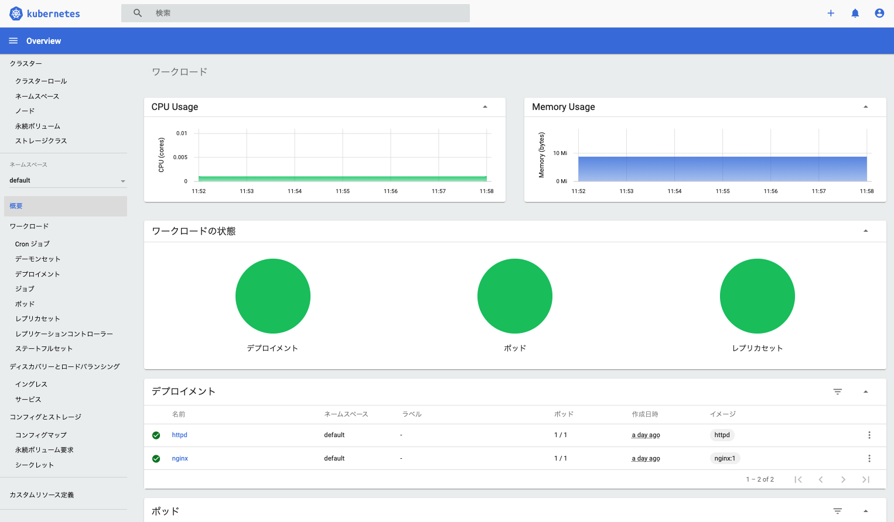
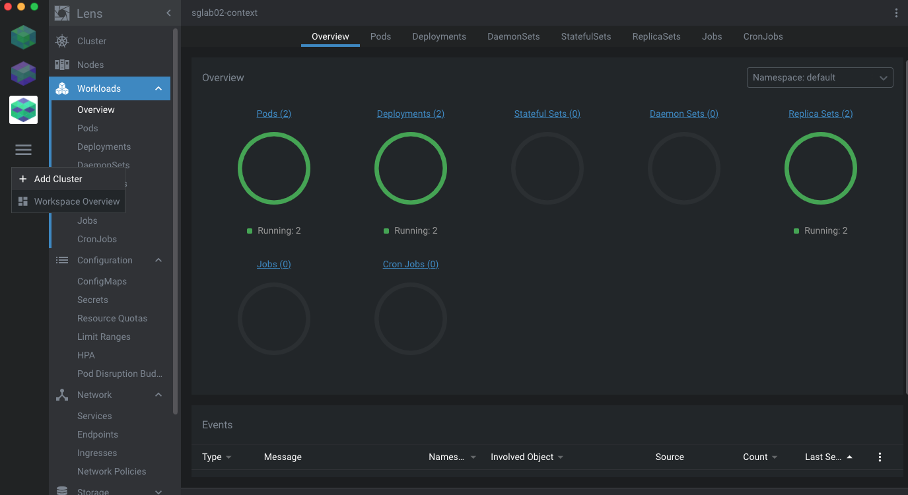
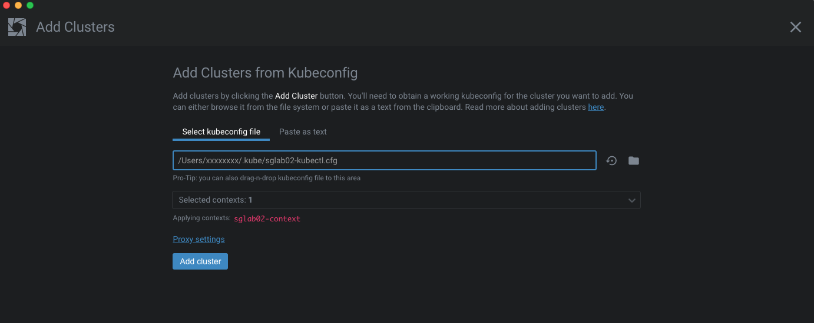
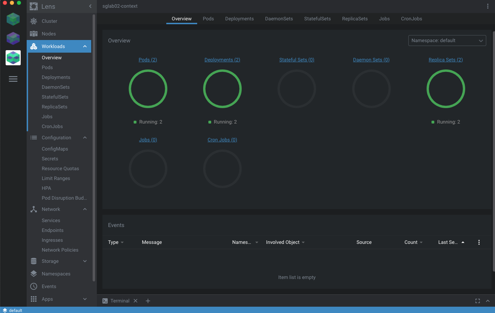

# k8s-monitoring

## 1.kubernetesのデフォルトダッシュボードを使う

### デプロイ
```

kubectl apply -f https://raw.githubusercontent.com/kubernetes/dashboard/v2.0.0/aio/deploy/recommended.yaml
```
### プロキシを起動
```
kubectl proxy
```
### ブラウザでダッシュボードにアクセス
http://localhost:8001/api/v1/namespaces/kubernetes-dashboard/services/https:kubernetes-dashboard:/proxy/ 





## 2.LENSを使う

### Lensとは
 （レンズ）は Kubernetes クラスタの運用管理ツールです。 「 Kubernetes のための IDE 」（統合開発環境）と銘打っていますが、これで開発をするわけではなく、 IDE 的な網羅性のあるデスクトップ用の管理ツールという意味のようです。
オープンソースで無料で利用でき、 Windows 、 Mac 、 Linux の各 OS のパッケージがあります。

* 公式サイト: https://k8slens.dev
* Github: https://github.com/lensapp/lens
### インストール

公式サイトからダウンロードしてからインストーラを実行する

### 初期設定

LENSを起動してからkubeconfigファイルを利用してkubernetesクラスタを追加



Workload:


