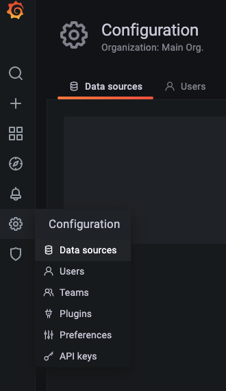
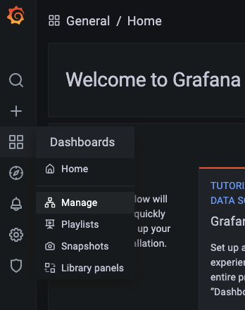
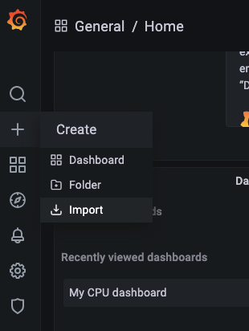

# Prometheus & Grafanaによる監視ダッシュボードの作成

本Labの前提：　nginx ingress controller導入済み

nginx ingress controllerのEXTERNAL-IPの確認方法
```
$ kubectl get svc -n ingress-nginx
NAME                                 TYPE           CLUSTER-IP       EXTERNAL-IP    PORT(S)                      AGE
ingress-nginx-controller             LoadBalancer   172.19.51.177    10.129.45.13   80:31546/TCP,443:31615/TCP   36h
ingress-nginx-controller-admission   ClusterIP      172.19.215.144   <none>         443/TCP                      36h
```

## 1. Promethus

Karbonクラスタ作成時に自動的にPrometheusをインストールしました。
PersistentVolumeはNutanix Volumeを利用しています。

確認：
### Lens > Workloads > Pods, 「All Namespaces」を選択します


### prometheus-k8s-0 を選択

### Volumesの配下「persistentVolume Claim」を選択


### kubectlで確認


## 2. Grafana

構成：


### ingress作成
```
apiVersion: networking.k8s.io/v1
kind: Ingress
metadata:
  name: ingress-grafana
  namespace: monitoring
  annotations:
    kubernetes.io/ingress.class: "nginx"
spec:
  rules:
  - host: "grafana.local" 
    http:
      paths:
      - path: /
        pathType: Prefix
        backend:
          service:
            name: grafana
            port:
              number: 3000
```
### ホスト名：  grafana.localを作業PCのhostsファイルに追記
```
#Mac: 
sudo echo "<<ingress-nginx-controllerのEXTERNAL-IP>> grafana.local >> /etc/hosts"

# Windows:
Add-Content -Path C:\Windows\System32\drivers\etc\hosts -Value "<ingress-nginx-controllerのEXTERNAL-IP>`grafana.local" -Force
cat C:\Windows\System32\drivers\etc\hosts
```
### Deploy
```
kubectl -f grafana-deployment.yaml
kubectl -f ingress-grafana.yaml
```
### 動作確認
ブラウザでhttp://grafana.localにアクセス

以下の画面が表示されます。


初回ログイン：
* Username - admin
* Password - admin


初期表示画面：


### Datasourceを設定

#### 1. Prometheus-operatedのEndpointを取得
```
kubectl get ep -n ntnx-system | grep prometheus-operated
```
例：
```
prometheus-operated           172.20.223.203:9090   
```

#### 2. Grafana画面で,左側のギアアイコンを選択し、「Configuration」配下の「Data source」を選択



#### 3. Prometheusを選択し、URLにPrometheus-operatedのEndpointを設定

例： http://172.20.223.203:9090


#### 4. Save & Test をクリック


### ダッシュボード作成

#### 1. Grafana画面からDashboard > Manageを選択


#### 2. New Dashboard > + Add an empty panel をクリック

metricsにcpuで検索し、cluster:node_cpu:sum_rate5m を選択


保存


グラフ表示


### ダッシュボードのインポート

#### 1. Dashboards > Manage を選択してからImportをクリック




#### 2.  Import via grafana.comに Dashboard ID を指定し、Loadをクリック

インポート可能なDashbord：
https://grafana.com/grafana/dashboards


#### 3. Prometheusの配下Prometheus data sourceを選択し、Importをクリック


以下のようなダッシュボードが表示されます。

ID: 1621


ID: 1860


